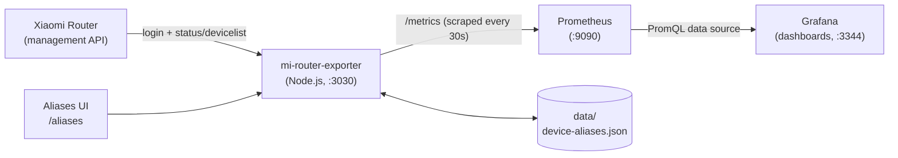

# Network Monitor

[中文文档](readme_CN.md)

A home-network monitoring stack for Xiaomi routers. The exporter queries the router API, Prometheus stores the collected metrics, and Grafana provides dashboards.



## Part 1: User Guide

### Prerequisites

- Docker Engine with Docker Compose v2
- A host on the same LAN as the Xiaomi router and able to reach its management API

### Configure

1. Create the local environment file. It is ignored by Git and must not be committed.

   ```bash
   cp .env.example .env
   ```

2. Set the router address, router administrator password, and a strong Grafana password in `.env`:

   ```dotenv
   ROUTER_URL=192.168.31.1
   ROUTER_PASSWORD=your_router_password
   GRAFANA_ADMIN_USER=admin
   GRAFANA_ADMIN_PASSWORD=use_a_strong_unique_password
   ```

3. Optional settings:

   | Variable | Default | Purpose |
   | --- | --- | --- |
   | `LOGLEVEL` | `warn` | Exporter application log level. |
   | `GRAFANA_ANONYMOUS_ENABLED` | `false` | Allow unauthenticated Grafana viewer access. Keep this `false` unless public viewing is intentional. |
   | `ENABLE_DEBUG` | `false` | Enable the exporter `/debug` endpoint only for troubleshooting. |
   | `CSV_LOG_DIR` | exporter `logs` directory | Override the directory used for exporter event logs. |
   | `CSV_LOG_MAX_BYTES` | `5242880` | Rotate the event log when it reaches this size in bytes. |

### Start and stop

Build the exporter image and start the full stack:

```bash
docker compose up -d --build
```

Check service state and logs when needed:

```bash
docker compose ps
docker compose logs -f mi-router-exporter
```

Stop the stack while retaining Prometheus and Grafana data volumes:

```bash
docker compose down
```

### Access and security

| Service | Address | Notes |
| --- | --- | --- |
| Grafana | <http://localhost:3344> | Login is required by default. Use `GRAFANA_ADMIN_USER` and `GRAFANA_ADMIN_PASSWORD`. |
| Prometheus | <http://localhost:9090> | Prometheus expression browser and target status. |
| Exporter metrics | <http://localhost:3030/metrics> | Prometheus-format metrics endpoint. |
| Exporter health | <http://localhost:3030/health> | Returns HTTP 200 when the exporter process is running. |

All published ports bind to `127.0.0.1` by default, so they are not reachable from other LAN devices. Do not enable anonymous Grafana access or change the port bindings without considering the security impact.

### What is monitored

The exporter collects:

- Router CPU, memory, temperature, uptime, and connected-device counts
- WAN upload/download speeds, peak speeds, and cumulative counters
- Per-device traffic, speed, online state, MAC address, name, and IP address where the router supplies it
- Canonical per-device cumulative counters `mi_router_device_download_total` / `mi_router_device_upload_total` (plus legacy gauge names for compatibility)
- Exporter health signals under `mi_router_exporter_*`, including login successes/failures, router API errors, scrape errors, the last scrape duration, and the last successful scrape timestamp

The `/debug` endpoint is deliberately unavailable unless `ENABLE_DEBUG=true`. Disable it again after diagnosis.

### Dashboards

Provisioned Grafana dashboards live under `grafana/dashboards/` and are loaded automatically.

#### Home Network Monitor (`home-network-monitor`)

- Per-device realtime upload/download charts use unfilled multi-series lines (`fillOpacity: 0`) so each selected device stays visually distinct.
- `全设备总带宽趋势（下载 / 上传）` shows aggregate device download and upload as two plain positive curves.
- TOP 10 panels are **time-window incremental** rankings (`increase(...[$__range])`), so they change with Grafana's selected time range.
- Pie charts show current per-device upload/download bandwidth share (devices with rate `> 0` only).
- `设备带宽覆盖率` compares summed device rates against WAN rates:
  - 5-minute smoothing on both numerator and denominator
  - low-flow shield: hide points when WAN average rate `< 200 KB/s`
  - display clamp: `clamp_max(..., 200)` so the axis stays readable up to 200%
  - values above 100% usually mean sampling jitter between device and WAN counters, not broadband plan capacity

#### Device Traffic Interval (`device-traffic-interval`)

- Interval bucket options include `5m,10m,30m,1h,3h,6h,1d`.
- Interval upload/download charts use unfilled multi-device lines with `palette-classic` coloring.
- Queries use canonical counters `mi_router_device_download_total` / `mi_router_device_upload_total` to avoid Prometheus `increase()` naming warnings.
- Summary table columns are ordered as: device name, IP address, MAC address, download, upload.

### Troubleshooting

- If Grafana has no data, open Prometheus Targets at <http://localhost:9090/targets> and verify the `mi-router` target is up.
- If the exporter returns HTTP 500, verify `ROUTER_URL` and `ROUTER_PASSWORD`, then inspect `docker compose logs mi-router-exporter`.
- The exporter retries router login up to three times and refreshes its token after expiry. Repeated login failures normally indicate an unreachable router or invalid credentials.
- Exporter event logs are persisted under `./logs` on the host and rotate when they reach the configured maximum size.

## Part 2: Maintainer Guide

### Project layout

- `docker-compose.yml` — the Prometheus, Grafana, and exporter services; pinned image versions, health checks, dependency order, and localhost-only port bindings
- `.env.example` — safe configuration template; never put actual secrets in this file
- `mi-router-exporter/` — Node.js exporter implementation
  - `MiRouter.js` — Xiaomi router authentication, token lifecycle, retries, and API calls
  - `metrics.js` — Prometheus text rendering and label escaping
  - `selfmetrics.js` — in-process exporter counters and scrape state
  - `csvlogger.js` — asynchronous, best-effort event logging with size-based rotation
  - `deviceId.js` — stable locally persisted exporter device identifier
  - `test/` — Node built-in test runner coverage
- `prometheus/prometheus.yml` — Prometheus scrape configuration
- `grafana/` — provisioned datasource and dashboards
- `docs/ops.md` — operational notes; historical material is under `docs/archive/`

### Local development and verification

The exporter requires a supported Node.js runtime (the container image uses Node.js 20). From the exporter directory:

```bash
npm install
npm test
npm run lint
```

After modifying exporter code or its dependencies, rebuild and restart the stack:

```bash
docker compose up -d --build
```

Then verify the health endpoint and inspect the generated metrics:

```bash
curl -fsS http://localhost:3030/health
curl -fsS http://localhost:3030/metrics | grep '^mi_router'
```

### Implementation notes

- The Docker image installs production dependencies only and runs as an unprivileged `exporter` user.
- Router tokens are cached for 24 hours; status failures clear the token, reauthenticate, and retry the complete status/device-list flow.
- Device labels are escaped before rendering Prometheus output. Preserve this behavior when adding labels or metrics.
- `mi_router_wan_download` and `mi_router_wan_upload` are counters; preserve their metric type when changing collection logic.
- Prefer `mi_router_device_download_total` / `mi_router_device_upload_total` for `increase()`/`rate()` queries. Keep legacy `mi_router_device_download` / `mi_router_device_upload` gauge names for backward compatibility.
- Bandwidth coverage panels should smooth numerator and denominator separately, shield low WAN flow, and clamp display when needed to avoid sampling-jitter spikes.
- The stable device ID and exporter logs are stored in the mounted `./logs` directory so they survive container recreation.
- Logging must remain best-effort: it must never make a metrics request fail. Avoid synchronous file I/O on the request path.
- Keep `/debug` gated behind `ENABLE_DEBUG=true`; it can expose router-derived device details.

### Operational changes

When changing service exposure, authentication defaults, or health checks, update both this guide and `readme_CN.md`, plus `.env.example` when configuration changes. Maintain the default localhost bindings and disabled anonymous access unless the project intentionally adopts a different security model.

## License

ISC

## Device aliases

Open the local management page at <http://localhost:3030/aliases> to assign custom display names by MAC address.

- Aliases are stored in `./data/device-aliases.json` on the host (mounted into the exporter container).
- Custom names survive `docker compose up -d --build` as long as the `./data` mount remains.
- Grafana shows the custom alias when present; otherwise it shows the router-provided name. Panel legends use `name (ip)` (alias preferred over router name).
- Changing a device name creates a new Prometheus time series identity, so historical graphs may look discontinuous around the rename.
